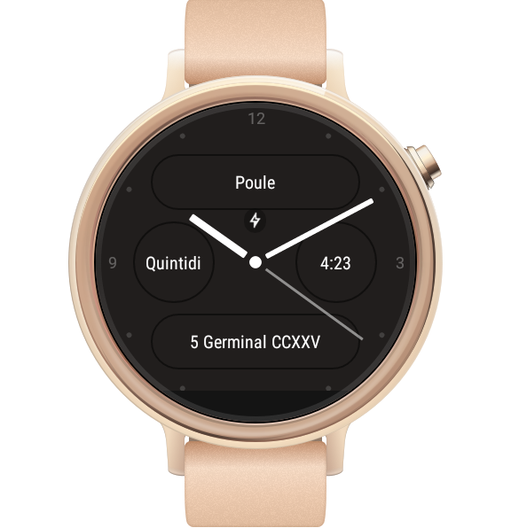
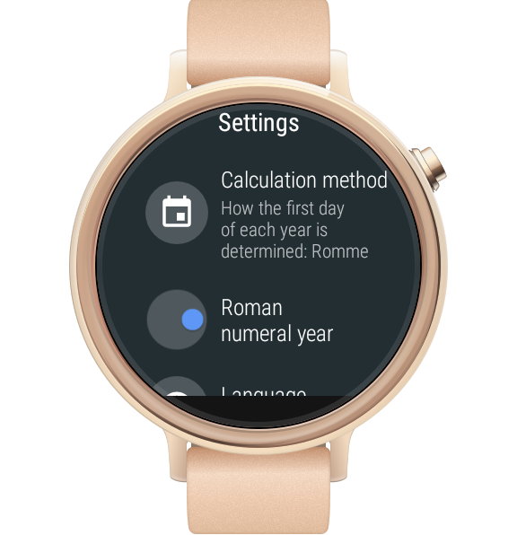

# French Revolutionary Calendar Android Wear Complications
This app provides complications for Android Wear wachfaces.

## Complications
The available complications are:
* The date. For example: 5 Germinal CCXXV
  - You may choose to display the year in Arabic or Roman numerals
* The day of the week. For example: Quintidi
* The decimal time. For example: 6:52
* The object of the day.  For example: Poule

Example watch face displaying all four complications:

## Settings
The following settings are available:
* The method used to calculate the first day of the year.  Available choices are Romme, Equinox, and Von Mädler
* Displaying the date year in Roman numerals.
* The language: This is used to display the month name, weekday name, and object of the day.

